    
    <h3>Hi, I'm Raúl! 👋</h3>
    
<em>A passionate Web Developer constantly learning and exploring new technologies 🚀</em>

## 🧑‍💻 About Me
- 💻 Experienced in **PHP, JavaScript, MySQL, and Java**.
- ⚙ Exploring **new technologies** like **Python** and **React**.  

## 🚀 Technologies and Tools

## 📊 GitHub Stats

