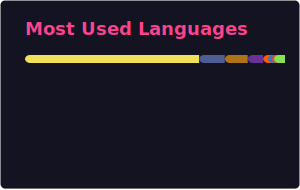
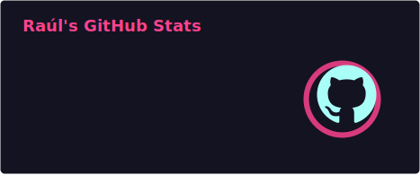

<div align="center">
    
    <h3>¡Hola, soy Raúl!</h3>
    
</div>

## Sobre mí
* Soy un desarrollador web que entiende el código como una herramienta para resolver problemas reales.
* Mi base técnica se asienta en la robustez del backend con **PHP y Java**; actualmente, traslado esa experiencia a la agilidad del frontend con **React** y al desarrollo de APIs con **Python**.
* Exploro la escalabilidad en arquitecturas modernas de JavaScript y el perfeccionamiento de sistemas críticos en Java.

## Stack Técnico
```json
{
    "Backend": ["PHP", "Java", "Python", "Node.js"],
    "Frontend": ["Astro", "React", "JavaScript", "TypeScript", "HTML5", "CSS3", "Tailwind", "BootStrap"],
    "Bases de datos": ["MySQL", "MariaDB", "SQLite", "MongoDB", "Redis"],
    "Herramientas": ["Git", "Docker", "GitHub Actions", "Linux Bash", "Postman", "Jest"]
}
```

## Mis estadísticas



### Conectemos
Si tienes un proyecto en mente o simplemente quieres compartir ideas sobre desarrollo, no dudes en escribirme.

<div align="left">
    <a href="https://linkedin.com/in/raul-parada-de-la-fuente"></a>&nbsp;
    <a href="mailto:raul.paradadelafuente@gmail.com"></a>&nbsp;
    <a href="https://devparada.dev"></a>
</div>
