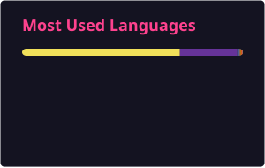
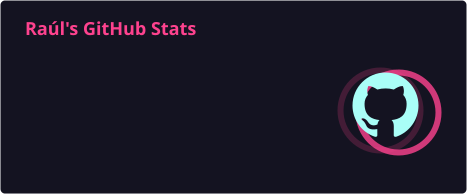

<div align="center">

  

  <br/>

  %3B;echo+%22Resolviendo+retos+t%C3%A9cnicos+con+c%C3%B3digo+limpio%22%3B;git+commit+-m+%22feat%3A+creando+software+de+calidad%22;docker+run+-d+--name+devparada+innovation%3Alatest)

</div>

```bash
raul@devparada:~$ screenfetch
       .---.      │ OS          : Linux & Windows Workstation
      /     \     │ Host        : devparada.dev
     | O _ O |    │ Role        : Full Stack & Backend Developer
     /  \_/  \    │ Core Stack  : Java & PHP
   .' /     \ `.  │ Focus       : Scalable APIs & Modern Web
  / _|       |_ \ │ Environment : Linux & Docker
  `"   `---'   "` │ Mindset     : "Código limpio hoy, mantenible mañana."
```

## 💡 Sobre mí

- 💻 **Desarrollador Backend & Full Stack**: Apasionado por la tecnología y el desarrollo de software. Mi base técnica se apoya en la solidez de **Java (Spring Boot)** y **PHP**, creando APIs seguras, robustas y eficientes.
- 🚀 **Frontend moderno & dinámico**: Llevo la disciplina del backend a la agilidad del cliente trabajando con **React**, **Astro** y **TypeScript** para construir interfaces fluidas y orientadas a una gran experiencia de usuario.
- 🗄️ **Bases de datos & Rendimiento**: Disfruto diseñando arquitecturas de datos relacionales (**MySQL, MariaDB, SQLite**) y NoSQL (**Redis, MongoDB**), optimizando consultas para exprimir el máximo rendimiento.
- 🛠️ **Cultura DevOps & Entorno**: Trabajo habitualmente en entornos **Linux**, automatizando flujos con **GitHub Actions** y empaquetando aplicaciones en contenedores **Docker** para asegurar despliegues limpios y confiables.

---

## 🛠️ Stack

| Categoría | Tecnologías |
| :--- | :--- |
| **⚙️ Backend** |     |
| **🎨 Frontend** |       |
| **🗄️ Bases de Datos** |      |
| **🧰 DevOps & Tools** |      |

---

## 📊 Estadísticas




---

## 📫 Contacto

Si tienes un proyecto en mente o simplemente quieres compartir ideas sobre desarrollo, no dudes en escribirme.

[](https://linkedin.com/in/raul-parada-de-la-fuente)
[](mailto:raul.paradadelafuente@gmail.com)
[](https://devparada.dev)

<div align="center">
  
</div>
